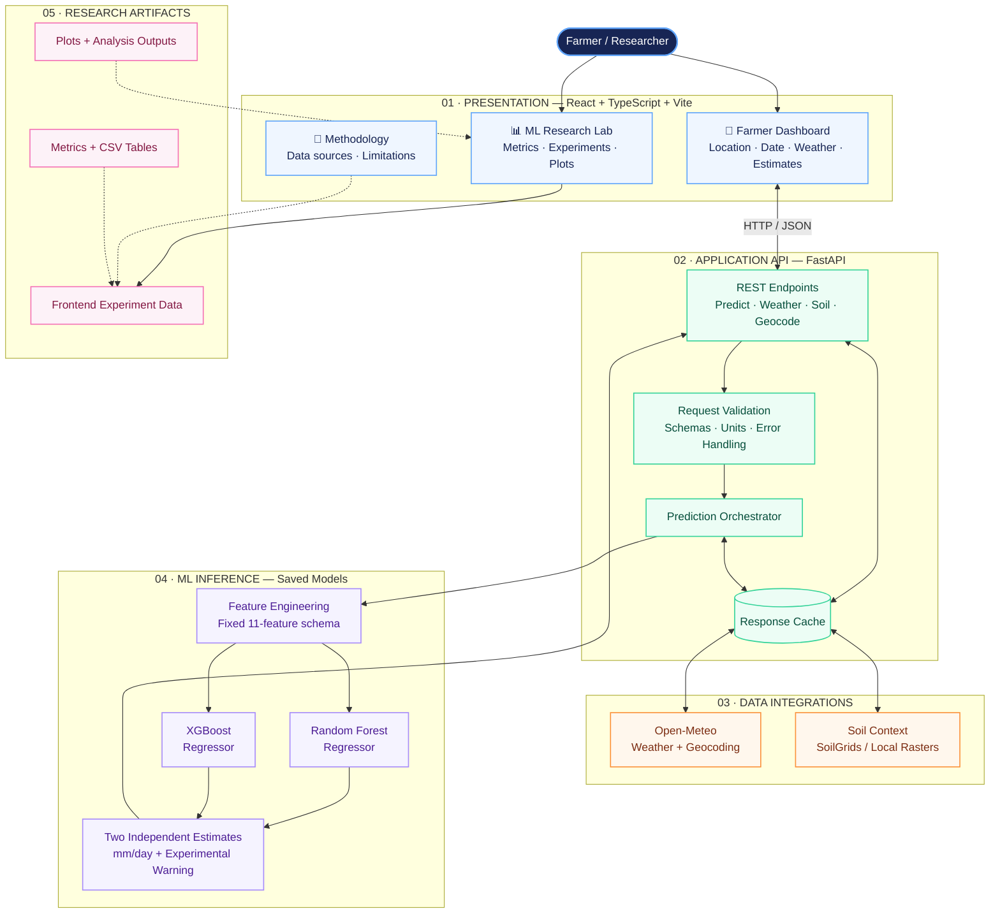
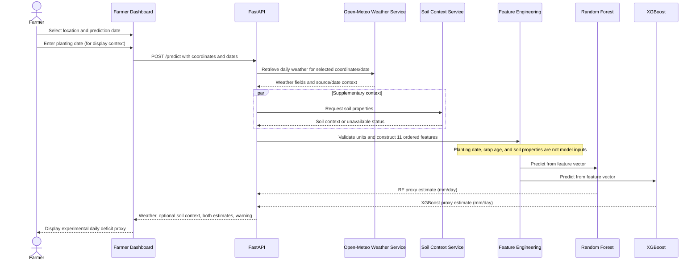

# ML-Based Sugarcane Irrigation Requirement Prediction System for India

A full-stack experimental decision-support prototype that combines **Random Forest** and **XGBoost regression**, weather retrieval, optional soil context, and an ML Research Lab to estimate a daily irrigation-deficit proxy for a selected location and date.

> **Important scientific limitation:** the current model target is formula-derived and simulated. It is **not measured farm irrigation demand** and the output is **not a validated irrigation recommendation**. Do not use it alone to decide irrigation volumes or schedules.

## Contents

- [Project overview](#project-overview)
- [Current capabilities](#current-capabilities)
- [System architecture](#system-architecture)
- [Dataset and target construction](#dataset-and-target-construction)
- [Machine-learning features](#machine-learning-features)
- [Model evaluation results](#model-evaluation-results)
- [Research experiments](#research-experiments)
- [Data sources and integrations](#data-sources-and-integrations)
- [Repository structure](#repository-structure)
- [Setup and running locally](#setup-and-running-locally)
- [API endpoints](#api-endpoints)
- [Testing](#testing)
- [Model files and Git LFS](#model-files-and-git-lfs)
- [Known limitations and next steps](#known-limitations-and-next-steps)

## Project overview

The application is designed to demonstrate how a farmer-facing interface could collect a location and prediction date, retrieve weather data, prepare the feature vector expected by the trained models, and display estimates from two regressors. Planting date is collected to calculate crop age for display, but **planting date and crop age are not model inputs** in the current model version.

The project has two primary user experiences:

1. **Farmer Dashboard** — location/date input, weather information, optional soil context, and predictions from both models.
2. **ML Research Lab** — evaluation metrics and exploratory analyses such as feature importance, SHAP summaries, feature ablation, learning curves, PCA, sensitivity analysis, residuals, location-wise errors, and weather clustering.

## Current capabilities

- FastAPI backend with prediction, health, geocoding, weather, soil, and experiment-summary endpoints.
- React + TypeScript + Vite frontend.
- Random Forest and XGBoost model inference using a fixed 11-feature schema.
- Open-Meteo weather/geocoding integration.
- SoilGrids integration attempt with optional local-raster fallback; soil properties are supplementary context only.
- Cached weather, geocoding, and soil responses.
- Experiment summary tables and plot assets in the repository.
- Automated pytest tests for API and service behavior.

## System architecture

The system is organized into four layers: **presentation**, **API and orchestration**, **data integrations**, and **ML inference / research assets**. The Farmer Dashboard and ML Research Lab are separate user experiences that share the same frontend and backend, but they serve different purposes.

### High-level system architecture

The diagram below separates the **user experience**, **API orchestration**, **external data services**, **model inference**, and **research artifacts**. Solid arrows represent the main application flow; dashed arrows represent supplementary context or research data.



> **Model boundary:** planting date, crop age, and soil properties are not inputs to the current models. The inference models use only the documented 11-feature weather/location/season vector. Soil is supplementary context, and the Research Lab visualizes saved experiment artifacts rather than running a separate prediction model.

### Farmer prediction request flow



### Layer responsibilities

| Layer / component | Responsibility | Important boundary |
|---|---|---|
| Farmer Dashboard | Collects location, planting date, and prediction date; presents weather and both estimates | Planting date is contextual in the current model version; it does not affect inference |
| ML Research Lab | Presents model metrics, experiment summaries, plots, and error analyses | Some displayed experiment values are maintained in a typed frontend data module rather than loaded dynamically from every CSV |
| FastAPI routes and schemas | Validates requests, exposes REST endpoints, and returns structured responses | API success does not by itself prove model artifacts loaded or that outputs are agronomically valid |
| Weather service | Retrieves daily weather and geocoding data from Open-Meteo, with caching | Must not silently replace missing required weather values with arbitrary defaults |
| Soil context service | Attempts to retrieve soil data and optionally read local rasters | Soil properties are supplementary only; current models do not use them |
| Feature engineering | Converts weather/location/date into the exact 11 model inputs in the documented order | Feature names, units, preprocessing, and order must match training |
| Random Forest and XGBoost | Produce two independent estimates of the simulated target | Predictions should not be averaged or treated as calibrated uncertainty without additional evaluation |
| Experiment assets | Store metrics, split metadata, tables, and plot files used by research views | Research results must be traceable to the relevant split and experiment procedure |

### Prediction boundary and interpretation

The inference path is:

1. The user chooses a location and prediction date; the app retrieves weather for that location/date.
2. The backend validates required weather fields and derives the seasonal features `sin_day_of_year` and `cos_day_of_year`.
3. The backend constructs the fixed, ordered 11-feature vector and sends it to both saved models.
4. The API returns the two independent model estimates, relevant weather/context information, and the experimental-use warning.
5. The frontend labels the output as a **simulated daily irrigation-deficit proxy (mm/day)**, not as measured water demand or a validated irrigation schedule.

Soil data and planting date may be displayed as context, but neither is included in the current model feature vector. The research dashboard is an analytical view of saved experiment results; it is not a separate inference model.

## Dataset and target construction

The experiment metadata describes a dataset with **71,214 daily records**, **39 candidate Indian locations**, and **47 columns**. These are location-weather records; they should not be interpreted as 71,214 independent farm trials or as evidence that sugarcane was planted at every location on every recorded day.

The target column is `irrigation_requirement_mm`. It is a **simulated daily net irrigation-deficit proxy in mm/day**, generated from weather/date/location-derived calculations rather than measured irrigation events.

The documented target-construction approach is:

1. Calculate reference evapotranspiration (`ET0`) using the Hargreaves–Samani method, based on temperature range, mean temperature, latitude, and date-derived extraterrestrial radiation.
2. Calculate a crop evapotranspiration proxy: `ETc_proxy = 1.20 × ET0`, using a fixed assumed crop coefficient.
3. Calculate effective rainfall proxy: `effective_rainfall_proxy = min(0.80 × precipitation, ETc_proxy)`.
4. Calculate the target: `irrigation_requirement_mm = max(ETc_proxy − effective_rainfall_proxy, 0)`.

The fixed crop coefficient and effective-rainfall fraction are assumptions, not field-calibrated parameters. This target construction does not account for measured soil-water storage, crop stage, irrigation method, irrigation efficiency, field management, or observed irrigation events.

### Dataset quality context

The bundled `data_quality.csv` reports:

- All 11 model input features have 0% missing values in the summarized dataset.
- Soil properties have approximately **89.744% missingness** in that dataset.
- Field ID, crop variety, planting/harvest dates, growth stage, irrigation method, water source, and previous irrigation are 100% missing in that dataset summary.
- The model therefore does not currently use soil properties or crop-stage variables.

The raw training dataset is not included in this repository snapshot; the experiment summaries, tables, and plots are included.

## Machine-learning features

Both models expect these **11 features in this exact order**:

| # | Feature | Unit / meaning | Source |
|---:|---|---|---|
| 1 | `latitude` | Decimal degrees | Selected coordinates / geocoding |
| 2 | `longitude` | Decimal degrees | Selected coordinates / geocoding |
| 3 | `temperature_mean_c` | °C | Open-Meteo daily mean temperature |
| 4 | `temperature_max_c` | °C | Open-Meteo daily maximum temperature |
| 5 | `temperature_min_c` | °C | Open-Meteo daily minimum temperature |
| 6 | `relative_humidity_percent` | % | Open-Meteo daily mean relative humidity |
| 7 | `precipitation_mm_day` | mm/day | Open-Meteo daily precipitation sum |
| 8 | `wind_speed_m_s` | m/s | Open-Meteo daily maximum 10 m wind speed |
| 9 | `solar_radiation_kwh_m2_day` | kWh/m²/day | Open-Meteo shortwave radiation sum converted from MJ/m²/day by dividing by 3.6 |
| 10 | `sin_day_of_year` | -1 to 1 | Seasonal encoding: `sin(2π × day_of_year / 365.25)` |
| 11 | `cos_day_of_year` | -1 to 1 | Seasonal encoding: `cos(2π × day_of_year / 365.25)` |

**Not model inputs:** planting date, crop age, soil pH, texture, bulk density, soil organic carbon, CEC, crop variety, and growth stage. The current app may display some of these as context, but they do not influence the predictions.

## Model evaluation results

The bundled `experiment_summary.json` and `tables/new_split_baseline_metrics.csv` report the following metrics. The reported split contains **56,606 training records across 31 locations** and **14,608 evaluation records across 8 listed held-out locations**.

| Model | Split | Records | MAE (mm/day) | RMSE (mm/day) | R² |
|---|---|---:|---:|---:|---:|
| Random Forest | Train | 56,606 | 0.1056 | 0.1626 | 0.9993 |
| Random Forest | Reported held-out locations | 14,608 | **0.2156** | 0.3197 | 0.9971 |
| XGBoost | Train | 56,606 | 0.1758 | 0.2295 | 0.9986 |
| XGBoost | Reported held-out locations | 14,608 | 0.2250 | **0.2939** | **0.9975** |

### How to interpret these metrics

- **MAE** is the average absolute prediction error, expressed here in mm/day.
- **RMSE** penalizes larger errors more strongly than MAE and is also expressed in mm/day.
- **R²** measures fit relative to the variance of the target in the evaluation data; it is not a measure of real-world irrigation usefulness.
- In the reported evaluation, Random Forest has a slightly lower MAE, while XGBoost has a lower RMSE and slightly higher R². These metrics do not establish a universally superior model.
- The target itself is formula-derived. Strong metrics primarily show that the model can reproduce that constructed proxy; they do **not** demonstrate accuracy against actual farm irrigation requirements.
- Before making a strong claim of geographic generalization, verify the training notebook/model provenance and confirm that the saved models were not trained on any of the evaluation records or locations. The repository contains split metadata but does not include the original training notebook or raw training dataset needed to independently reproduce that separation.

## Research experiments

The `sugarcane_ml_experiments_results/` directory contains experiment summaries, CSV tables, and plots used by the ML Research Lab. The experiments below answer different questions: overall fit, the effect of data quantity, which features the models rely on, whether feature groups can be removed, whether dimensionality reduction helps, and how errors vary across weather patterns and locations.

> **Interpretation boundary:** unless explicitly stated otherwise, the metrics below evaluate predictions against the **formula-generated irrigation-deficit proxy**, not measured farm irrigation. These experiments explain model behavior on the constructed target; they do not establish agronomic validity or prove that a farmer should apply the predicted amount.

### Experiment results and interpretations

#### 1. Baseline model comparison

| Model | Evaluation MAE (mm/day) | Evaluation RMSE (mm/day) | Evaluation R² | Result interpretation | Conclusion |
|---|---:|---:|---:|---|---|
| Random Forest | **0.215553** | 0.319741 | 0.997057 | Has the lower average absolute error of the two models. | Slight advantage when judged by MAE. |
| XGBoost | 0.224959 | **0.293889** | **0.997514** | Has lower RMSE and slightly higher R², indicating better performance on those two reported metrics. | Slight advantage for larger-error-sensitive RMSE and overall fit; neither model wins every metric. |

The high R² values are **not percentage accuracy**. They describe fit to the simulated target in this evaluation. The results do not show how close either model is to measured irrigation demand.

#### 2. Learning-curve analysis

Learning curves test how validation error changes when the model receives progressively more training data.

| Model | Training fraction | Validation MAE (mm/day) | Validation RMSE (mm/day) |
|---|---:|---:|---:|
| Random Forest | 10% | 0.4519 | 0.6210 |
| Random Forest | 100% | 0.2159 | 0.3206 |
| XGBoost | 10% | 0.3064 | 0.4102 |
| XGBoost | 100% | 0.2219 | 0.2895 |

**Interpretation:** validation MAE and RMSE fall as the training fraction increases for both models in this experiment. Random Forest starts with higher error at the smallest training fraction, while its validation MAE is slightly lower at the full-data setting; XGBoost has slightly lower full-data RMSE. This indicates that training-data quantity mattered for reproducing the proxy target in the tested setup.

**Conclusion:** use the full available training set for the reported comparison, but do not infer that adding any amount of data will always improve performance or that the models will generalize to new farms and seasons.

#### 3. Feature importance

Tree-based feature importance indicates how much the fitted models relied on features when reducing prediction error. It does not prove that a feature causes irrigation demand.

| Feature | Random Forest importance | XGBoost importance | Interpretation | Conclusion |
|---|---:|---:|---|---|
| Maximum temperature | **63.63%** | **42.79%** | Highest reported importance for both models. | A leading predictor for reproducing the constructed target. |
| Precipitation | **32.01%** | **33.01%** | Second major feature for Random Forest and a similarly important feature for XGBoost. | Rainfall-related information is important to the proxy calculation. |
| Solar radiation | 1.39% | 9.09% | More prominent in XGBoost than in Random Forest. | The two model families distribute importance differently across secondary features. |
| Relative humidity | — | 4.80% | A smaller reported contribution in XGBoost. | Secondary model reliance; not evidence of no physical relevance. |
| Mean temperature | — | 4.63% | A smaller reported contribution in XGBoost. | Secondary model reliance. |

A dash means the corresponding value is not reproduced in this summary; it does **not** mean the feature has zero importance.

**Conclusion:** maximum temperature and precipitation dominate the reported feature-importance results, which is consistent with a target constructed from weather-based evapotranspiration and effective rainfall. Since those same weather variables contribute to target generation, this pattern is expected and is not causal proof.

#### 4. SHAP explainability

SHAP estimates how features contribute to a model's output. Mean absolute SHAP values summarize the typical magnitude of a feature's contribution across the evaluated examples; they are not percentages.

| Feature | Random Forest mean absolute SHAP value | XGBoost mean absolute SHAP value | Interpretation | Conclusion |
|---|---:|---:|---|---|
| Maximum temperature | ~3.182 | ~2.756 | Largest reported mean absolute SHAP value among the listed features. | Temperature has a strong influence on predictions from both models. |
| Precipitation | ~2.755 | ~2.590 | Also has a large typical contribution to model output. | Rainfall strongly influences the learned proxy estimate. |

The SHAP values describe learned model behavior and the model's approximation of the simulated target. They do not show that changing a feature in the real world would cause the same change in irrigation need.

**Conclusion:** the SHAP results support the feature-importance finding that maximum temperature and precipitation are the leading contributors. Use SHAP to explain the fitted models, not to claim agronomic causality.

#### 5. Feature-ablation study

Feature ablation removes a feature group and evaluates how performance changes. Lower MAE means closer predictions to the formula-generated target in the tested split.

| Feature set | Random Forest MAE (mm/day) | XGBoost MAE (mm/day) | Interpretation | Conclusion |
|---|---:|---:|---|---|
| All 11 features | **0.2156** | **0.2250** | Best MAE among the listed configurations for both models. | The complete feature set performs best in this comparison. |
| Without location | 0.2672 | 0.3260 | Removing latitude/longitude increases error. | Location information helps reproduce geographic variation in the target dataset. |
| Without seasonal features | 0.3104 | 0.4154 | Removing day-of-year sine/cosine features increases error. | Seasonal encoding contributes useful information. |
| Weather only | 0.3745 | 0.4800 | Weather features alone perform worse than the full feature set. | Location and seasonal information complement weather inputs. |
| Location + seasonality only | 2.5722 | 2.7432 | Error is much higher without weather features. | Location and calendar features cannot replace daily weather inputs. |

**Conclusion:** all 11 inputs work best among the tested groups. Weather is central, while location and seasonal features add useful information for approximating the constructed target. This does not prove every feature would be necessary for a model trained on independently measured irrigation data.

#### 6. Principal Component Analysis (PCA)

PCA transforms the original variables into fewer combined components that preserve as much input variance as possible. The experiment tested whether reducing the 11 inputs could maintain prediction performance.

| Input representation | Variance retained | Random Forest MAE (mm/day) | XGBoost MAE (mm/day) | Interpretation | Conclusion |
|---|---:|---:|---:|---|---|
| 3 principal components | 71.98% | 1.292 | 1.399 | Substantial information is compressed away and MAE increases. | Too much predictive information is lost for this setup. |
| 5 principal components | 87.70% | 0.992 | 1.178 | More variance is retained, but error remains higher than with the original inputs. | Better than 3 components, but still not competitive with the full feature set. |
| 8 principal components | 98.61% | 0.630 | 0.688 | Nearly all input variance is retained, but prediction error remains higher. | High variance retention does not guarantee preservation of target-relevant information. |
| Original 11 features | Original feature space | **0.2156** | **0.2250** | Lowest MAE among the listed representations. | Original features performed best in this experiment. |

**Conclusion:** PCA reduced dimensionality but did not improve prediction performance in the tested configurations. For the current prototype, retaining the original 11 features is the better-supported choice. PCA can still be useful for visualization or other exploratory analyses.

#### 7. K-Means weather clustering

K-Means groups records with similar weather-feature patterns. The cluster labels below are descriptive summaries, not official climate classes or sugarcane growth stages.

| Weather cluster summary | Mean temperature | Mean rainfall | Random Forest MAE | XGBoost MAE | Interpretation and conclusion |
|---|---:|---:|---:|---:|---|
| Very wet / humid | 26.1°C | 20.47 mm/day | **0.122** | 0.192 | Lowest reported Random Forest error; frequent rainfall may make the proxy easier for that model to reproduce in this group. |
| Cooler / drier | 17.8°C | 0.31 mm/day | 0.160 | 0.193 | Relatively low error for both models in this cluster. |
| Moderately warm / humid | 25.5°C | 2.93 mm/day | 0.256 | 0.250 | Highest reported error for Random Forest and close to the highest for XGBoost among these clusters. |
| Hotter / drier | 30.4°C | 0.53 mm/day | 0.203 | 0.209 | Intermediate error for both models. |

**Conclusion:** error differs across weather clusters, so a single overall metric can hide condition-specific differences. The cluster labels are exploratory; they should not be presented as validated agricultural categories or proof of model performance in all climate zones.

#### 8. Sensitivity analysis

Sensitivity analysis varies one input over a selected range while keeping the other inputs at reference values. It checks how the fitted model responds, not how a real crop would necessarily respond under a field experiment.

| Input sweep | Random Forest prediction range (mm/day) | XGBoost prediction range (mm/day) | Interpretation | Conclusion |
|---|---:|---:|---|---|
| Maximum temperature, approximately 22.13–41.42°C | 8.57 → 19.86 | 7.42 → 19.17 | Both models predict a higher proxy value at the hot end of the tested range. | The response is consistent with the temperature-sensitive target formula. |
| Latitude sweep | 9.57 → 8.93 | 9.42 → 7.22 | Predictions decrease over the tested latitude sweep, with different magnitudes between models. | Location can affect model output; the sweep is not a causal or geographic validation study. |

The arrows in the table mean “from the lower end of the sweep to the upper end.” Tree models can respond in steps rather than smoothly. A one-feature sweep may also create unrealistic combinations of weather and location inputs.

**Conclusion:** both models show an increasing predicted proxy across the tested maximum-temperature range. This is a useful model-behavior check, but it does not validate the output against actual sugarcane water requirements.

#### 9. Location-wise error analysis

Location-wise analysis examines errors on the reported held-out locations. It can reveal uneven performance that is hidden by an overall average.

| Model | Lowest reported location MAE | Highest reported location MAE | Additional observation | Interpretation and conclusion |
|---|---|---|---|---|
| Random Forest | TS02: **0.1218** | TN03: **0.3439** | TN02 MAE: 0.3324 | Error varies by location; TN02 and TN03 are among the higher-error locations in the reported results. |
| XGBoost | GJ02: **0.1976** | TN03: **0.3014** | TN02 MAE: 0.2688 | XGBoost also has location-dependent error, with TN03 highest among the reported locations. |

Each listed held-out location has 1,826 evaluation rows in the reported table. These are location-day records, not independent farm trials.

**Conclusion:** the models do not perform identically across locations. The higher errors reported for TN02/TN03 suggest areas for further investigation, but eight held-out locations are not enough to establish nationwide agronomic generalization.

#### 10. Residual analysis

A residual is calculated as **target value − predicted value**. A positive residual means the model predicted below the target; a negative residual means it predicted above the target.

| What is inspected | How to interpret it | Conclusion for this project |
|---|---|---|
| Residuals near zero | Predictions are close to the constructed target for those records. | Error analysis measures agreement with the formula-derived target, not measured farm irrigation. |
| Skew or a shifted distribution | May indicate systematic overprediction or underprediction. | Inspect the saved Random Forest and XGBoost plots before claiming that either model is unbiased. |
| Long tails or isolated extreme values | May indicate a small number of larger prediction errors. | Check extreme cases and input quality; do not summarize the plots as “normal” unless that is actually supported by the saved figure or a statistical test. |
| Error patterns across target/prediction range | May reveal changing error size or systematic structure. | Residual analysis complements MAE and RMSE but does not replace independent field validation. |

**Conclusion:** residual plots are useful for understanding the shape and direction of model errors. No numerical residual-distribution statistic is asserted here because the saved summary used for this README does not provide one.

#### 11. Data-quality audit

The data-quality audit checks whether the available data supports the intended analysis and identifies information gaps that constrain interpretation.

| Audit item | Reported result | Interpretation | Conclusion |
|---|---|---|---|
| Dataset size | 71,214 rows, 39 locations, 47 columns | Records represent location-day weather data. | Do not describe the dataset as 71,214 independent farm experiments. |
| Core model features and target | 0% missing in the summarized dataset | The 11 current model inputs and the target are complete in the audit summary. | The reported model feature schema can be assembled without missing values in that dataset snapshot. |
| Soil properties | Approximately 89.7% missing | Soil variables are too sparse to serve as reliable model inputs in this dataset. | Soil properties remain supplementary context and are not used by the current models. |
| Field ID and crop variety | 100% missing | Farm/cultivar-specific information is unavailable in the summary. | The project cannot currently compare performance by variety or farm identity. |
| Planting/harvest dates and growth stage | 100% missing | Crop development stage is not available for modelling. | Crop age and growth stage are not current model inputs. |
| Irrigation method, water source, previous irrigation | 100% missing | Observed management and irrigation-event details are unavailable. | The dataset cannot establish actual irrigation demand or management response. |
| Target provenance | Formula-derived proxy; no independent measured irrigation target | The model is trained to reproduce a constructed target. | Independent field or trusted measured irrigation data is the most important validation need. |
| Training/live weather sources | Training used NASA POWER; live integration uses Open-Meteo | Definitions, units, temporal aggregation, and source differences may affect consistency. | Harmonize training and live inference inputs before relying on production predictions. |
| Reproducibility artifacts | Original training notebook and raw training dataset are absent from the reviewed repository snapshot | The exact fitting procedure and split cannot be independently reproduced from this snapshot alone. | Preserve the dataset version, training notebook, split logic, seeds, parameters, and model provenance. |

**Conclusion:** the dataset is suitable for demonstrating an end-to-end prototype and for studying how models reproduce the proxy target, but it lacks independent measured irrigation, crop-stage, management, and reliable soil information needed for a validated irrigation advisory.

### Overall conclusion across the experiments

| Research question | Main result | Overall conclusion |
|---|---|---|
| Which baseline model is better? | Random Forest has slightly lower MAE; XGBoost has lower RMSE and slightly higher R². | There is no single winner across every metric. |
| Does more training data help? | Validation MAE and RMSE decrease as the training fraction increases in the tested curves. | More of the available training data improved fit to the proxy target in this setup. |
| Which inputs matter most? | Maximum temperature and precipitation rank highly in importance and SHAP summaries. | The models rely heavily on the weather variables central to target construction. |
| Are all features useful? | The full 11-feature set has the lowest MAE among tested ablation groups. | Weather, location, and seasonal features complement one another for this proxy. |
| Does PCA improve the model? | The original 11 features outperform the tested PCA component sets. | Dimensionality reduction was not beneficial for predictive error in these experiments. |
| Do errors vary by weather and location? | MAE varies across K-Means clusters and held-out locations. | Overall metrics should be read alongside subgroup error analysis. |
| What do sensitivity and residual checks show? | Predictions rise over the tested maximum-temperature sweep; residual plots help inspect over/underprediction and outliers. | These are model-behavior checks, not field experiments or proof of physical validity. |
| Is the project ready for real irrigation advice? | The target is simulated, farm-specific fields are missing, and training provenance is not fully reproducible from the repository snapshot. | Independent measured irrigation data, harmonized weather inputs, reproducible training, and field validation are required before advisory use. |

Taken together, the experiments show that Random Forest and XGBoost can approximate the constructed target closely and that feature importance, SHAP, ablation, learning curves, PCA, clustering, sensitivity, location-wise errors, residual analysis, and the data-quality audit help explain the models' behavior. **The central limitation remains unchanged:** the target is simulated rather than independently measured irrigation demand. The current application should therefore be described as an experimental ML prototype, not a validated irrigation advisory system.

The frontend contains a typed experiment-data module (`frontend/src/data/experimentsData.ts`) with values corresponding to the experiment tables. If the experiment tables change, verify and update the frontend data module as well; it should not be assumed to load all CSV tables dynamically at runtime.

## Data sources and integrations

### Open-Meteo

Used for location search and daily weather retrieval. The service selects forecast or historical data according to the requested date and rejects dates outside the supported forecast horizon. The app should display the source/date type and should not silently substitute arbitrary weather defaults when required values are unavailable.

- Weather documentation: https://open-meteo.com/en/docs
- Historical weather documentation: https://open-meteo.com/en/docs/historical-weather-api
- Geocoding documentation: https://open-meteo.com/en/docs/geocoding-api

Check the provider's current terms, availability, and usage limits before public or commercial deployment.

### ISRIC SoilGrids

The app attempts to retrieve soil properties and can optionally read local GeoTIFF rasters when available. SoilGrids REST availability should not be assumed. This repository contains a placeholder under `data/soilgrids/`, not a complete set of raster data. If soil data is unavailable, the app is intended to report that fact rather than invent values.

- SoilGrids information: https://www.isric.org/explore/soilgrids/
- SoilGrids documentation: https://docs.isric.org/globaldata/soilgrids/

**Important implementation note:** review the SoilGrids parser's depth selection before relying on displayed depth labels. The current parser selects the first non-null depth value without explicitly matching the requested `0–30 cm` interval, so a value from a shallower interval could be labelled as `0–30 cm`.

## Repository structure

```text
.
├── app/
│   ├── core/config.py                 # Paths, API URLs, model feature order
│   ├── main.py                        # FastAPI routes and static serving
│   ├── schemas/irrigation.py          # Request/response schemas
│   └── services/
│       ├── irrigation_service.py      # Model loading, feature engineering, inference
│       ├── weather_service.py         # Open-Meteo integration and caching
│       └── soil_service.py            # SoilGrids / local raster provider
├── Models/
│   ├── random_forest.joblib           # Git LFS model artifact
│   └── xgboost.joblib                 # Git LFS model artifact
├── frontend/
│   ├── src/pages/                     # Dashboard, model lab, methodology, history
│   ├── src/components/                # UI components and charts
│   ├── src/data/experimentsData.ts    # Experiment values used by research views
│   └── public/plots/                  # Static plot images
├── sugarcane_ml_experiments_results/
│   ├── experiment_summary.json
│   ├── experiment_split_info.json
│   ├── tables/                        # Evaluation CSV files
│   └── plots/                         # Generated figures
├── tests/                             # Pytest suite
├── data/soilgrids/                    # Optional local soil rasters (not bundled)
├── .env.example
├── .gitattributes
├── .gitignore
├── requirements.txt
└── README.md
```

## Setup and running locally

### Prerequisites

- Python with versions compatible with the serialized scikit-learn/XGBoost model artifacts.
- Node.js and npm.
- Git and Git LFS.
- Network access for Open-Meteo requests; SoilGrids may be unavailable.

### 1. Clone the repository and retrieve model artifacts

Use Git rather than downloading the repository as a ZIP when you need the actual model files:

```bash
git lfs install
git clone https://github.com/jainamdavda1-pixel/sugarcane-irrigation-prediction.git
cd sugarcane-irrigation-prediction
git lfs pull
```

GitHub source ZIP downloads may contain small Git LFS pointer files instead of the actual `.joblib` binaries. Verify the files before starting the API (see [Model files and Git LFS](#model-files-and-git-lfs)).

### 2. Set up the backend

```bash
python -m venv .venv
source .venv/bin/activate
python -m pip install --upgrade pip
pip install -r requirements.txt
```

Start the backend from the repository root:

```bash
uvicorn app.main:app --host 127.0.0.1 --port 8000 --reload
```

- API: http://127.0.0.1:8000
- Swagger docs: http://127.0.0.1:8000/docs
- Health endpoint: http://127.0.0.1:8000/health

The current backend configuration reads supported values from environment variables. Do not assume every variable shown in `.env.example` is consumed by the current config module; verify `app/core/config.py` before relying on a setting. For local defaults, a backend `.env` file is not required.

### 3. Set up the frontend

In a second terminal, from the repository root:

```bash
cd frontend
npm ci
```

Create `frontend/.env` if needed, using the existing `frontend/.env.example` as a template:

```env
VITE_API_BASE_URL=http://localhost:8000
```

Run the frontend in development mode:

```bash
npm run dev
```

Open the URL printed by Vite, typically http://localhost:5173.

To build the production frontend:

```bash
npm run build
```

After a production build, the backend serves `frontend/dist` when present.

## API endpoints

| Method | Endpoint | Purpose |
|---|---|---|
| `GET` | `/` | Serves the built frontend when available; otherwise returns API status/endpoints |
| `GET` | `/health` | Reports whether model objects loaded and the configured model path |
| `GET` | `/docs` | Interactive API documentation |
| `GET` | `/geocode?q=Kolhapur` | Searches locations using Open-Meteo geocoding |
| `GET` | `/weather?latitude=16.705&longitude=74.243&prediction_date=2026-10-02` | Retrieves daily weather for a location/date |
| `GET` | `/soil?latitude=16.705&longitude=74.243` | Retrieves supplementary soil context when available |
| `GET` | `/experiments/summary` | Returns the experiment summary JSON |
| `POST` | `/predict` | Predicts using location/date workflow or legacy direct features |

### Farmer prediction request

```json
{
  "latitude": 16.705,
  "longitude": 74.2433,
  "planting_date": "2026-06-15",
  "prediction_date": "2026-10-02",
  "location_name": "Kolhapur, Maharashtra"
}
```

The response includes weather, optional soil context, the exact feature dictionary passed to the models, predictions from both models, crop age for display, and an experimental-use warning. The planting date is not passed into the model.

### Legacy direct-feature request

The API also supports supplying all 11 model features directly. This mode is intended mainly for testing and backward compatibility. Ensure the feature names and units match the table above.

## Testing

Run the backend test suite from the repository root:

```bash
pytest -v
```

The test suite contains 26 tests. Model-loading and inference tests require actual model binaries, not Git LFS pointer text. A successful health response alone should not be taken as proof that both models loaded; inspect the `random_forest_loaded` and `xgboost_loaded` fields.

Frontend checks:

```bash
cd frontend
npm ci
npm run build
npm run lint
```

## Model files and Git LFS

The repository tracks model artifacts through Git LFS:

- `Models/random_forest.joblib` — approximately 416 MB (LFS pointer metadata reports 416,259,514 bytes).
- `Models/xgboost.joblib` — approximately 1.48 MB (LFS pointer metadata reports 1,479,226 bytes).

Check whether the model files were downloaded as real binaries or remain LFS pointers:

```bash
git lfs ls-files
head -n 3 Models/random_forest.joblib
```

If `head` shows `version https://git-lfs.github.com/spec/v1`, the file is still a pointer. Retrieve the real objects with:

```bash
git lfs pull
```

Do not commit API keys, local `.env` files, virtual environments, `node_modules`, or temporary build outputs.


